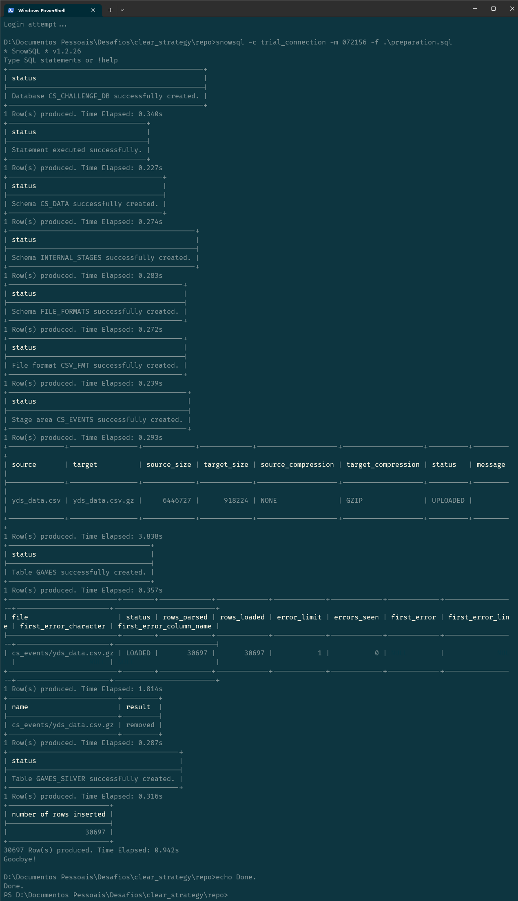

# Environment Preparation

## Requirements
- Snowsql command line interface (CLI) to run the commands from the command prompt (Bash, PowerShell, etc.) [find here](https://developers.snowflake.com/snowsql/){:target=_blank};
- Account configuration on `config` file of Snowsql CLI. The default location is `~/.snowsql/config` where `~/` is the user home folder;
- Multi-factor Authentication (MFA) enabled:
    * [Enrolling in MFA](https://docs.snowflake.com/en/user-guide/ui-snowsight-profile){:target=_blank}
    * [Connecting to Snowflake with MFA](https://docs.snowflake.com/en/user-guide/security-mfa){:target=_blank}
- Clone `cs_eda` project from GitHub:  
    * [Link](https://github.com/PetTher/cs_eda){:target=_blank}

## Database Settings & Data Ingestion
Before preparing the environment in Snowflake, I built a type of IaC script that created the database,
schemas, stages and a kind of raw table.  
In this script I also performed the data refinement/enrichment process, generating a second table.

After that, I made shell scripts, for both Bash and PowerShell.

### Shell Scripts
Shell script receives 2 arguments:  
1º -> Named connection in Snowsql config file;  
2º -> Passcode generated by MFA application (Duo).

Bash script:
``` bash title="IaC.sh"
#!/bin/bash

echo "Login attempt..."
snowsql -c $1 -m $2 -f ./preparation.sql
echo "Done."
```

PowerShell script:
``` bat title="IaC.bat"
echo Login attempt...
snowsql -c %1 -m %2 -f .\preparation.sql
echo Done.
```

### *Database Preparation Steps*  
The preparation script can be divided into 4 parts:  
- Creation of database and shemas;  
- Definition of File Format and Internal Stage creation (with csv dataset loading);  
- Definition of raw table (and csv file deletion);  
- Table refinement.

### *Preparation Script*  
The entire preparation script can be seen below:

<details>
<summary>Show/Hide SQL</summary>

```sql
CREATE OR REPLACE DATABASE CS_CHALLENGE_DB;

USE DATABASE CS_CHALLENGE_DB;

CREATE OR REPLACE SCHEMA CS_DATA;
CREATE OR REPLACE SCHEMA INTERNAL_STAGES;
CREATE OR REPLACE SCHEMA FILE_FORMATS;

CREATE OR REPLACE FILE FORMAT CS_CHALLENGE_DB.FILE_FORMATS.CSV_FMT
    FIELD_DELIMITER = ','
    TYPE = CSV
    SKIP_HEADER = 1
    FIELD_OPTIONALLY_ENCLOSED_BY='"'
;

CREATE OR REPLACE STAGE INTERNAL_STAGES.CS_EVENTS
    FILE_FORMAT = CS_CHALLENGE_DB.FILE_FORMATS.CSV_FMT
;

PUT 'file://./yds_data.csv' @INTERNAL_STAGES.CS_EVENTS;

CREATE OR REPLACE TABLE CS_DATA.GAMES(
    ID_IN_FILE NUMBER,
    MATCH_EVENT_ID NUMBER,
    LOCATION_X NUMBER,
    LOCATION_Y NUMBER,
    REMAINING_MIN NUMBER,
    POWER_OF_SHOT NUMBER,
    KNOCKOUT_MATCH NUMBER,
    GAME_SEASON VARCHAR(100),
    REMAINING_SEC NUMBER,
    DISTANCE_OF_SHOT NUMBER,
    IS_GOAL NUMBER,
    AREA_OF_SHOT VARCHAR(100),
    SHOT_BASICS VARCHAR(100),
    RANGE_OF_SHOT VARCHAR(100),
    TEAM_NAME VARCHAR(100),
    DATE_OF_GAME DATE,
    HOME_AWAY VARCHAR(100),
    SHOT_ID_NUMBER NUMBER,
    LAT_LNG VARCHAR(100),
    TYPE_OF_SHOT VARCHAR(100),
    TYPE_OF_COMBINED_SHOT VARCHAR(100),
    MATCH_ID NUMBER,
    TEAM_ID NUMBER,
    REMAINING_MIN_1 NUMBER,
    POWER_OF_SHOT_1 NUMBER,
    KNOCKOUT_MATCH_1 NUMBER,
    REMAINING_SEC_1 NUMBER,
    DISTANCE_OF_SHOT_1 NUMBER
);

COPY INTO CS_DATA.GAMES
    FROM @CS_CHALLENGE_DB.INTERNAL_STAGES.CS_EVENTS
    FILE_FORMAT = CS_CHALLENGE_DB.FILE_FORMATS.CSV_FMT
;

REMOVE @INTERNAL_STAGES.CS_EVENTS PATTERN='.*.csv.gz';

CREATE OR REPLACE TABLE CS_CHALLENGE_DB.CS_DATA.GAMES_SILVER (
    MATCH_ID	NUMBER(38,0),
    DATE_OF_GAME	DATE,
    YEAR_OF_GAME NUMBER(4,0),
    KNOCKOUT_MATCH	NUMBER(38,0),
    LAT_LNG	VARCHAR(100),
    HOME_AWAY	VARCHAR(100),
    LOCATION_X	NUMBER(38,0),
    LOCATION_Y	NUMBER(38,0),
    POWER_OF_SHOT	NUMBER(38,0),
    REMAINING_MIN	NUMBER(38,0),
    REMAINING_SEC	NUMBER(38,0),
    DISTANCE_OF_SHOT	NUMBER(38,0),
    IS_GOAL	NUMBER(38,0),
    AREA_OF_SHOT	VARCHAR(100),
    SHOT_BASICS	VARCHAR(100),
    RANGE_OF_SHOT	VARCHAR(100),
    TYPE_OF_SHOT	VARCHAR(100),
    TYPE_OF_COMBINED_SHOT	VARCHAR(100),
    NORMALIZED_TYPE_OF_SHOT	VARCHAR(100)
);

INSERT INTO CS_CHALLENGE_DB.CS_DATA.GAMES_SILVER (
    SELECT
        MATCH_ID,
        DATE_OF_GAME,
        YEAR(DATE_OF_GAME),
        KNOCKOUT_MATCH,
        LAT_LNG,
        HOME_AWAY,
        LOCATION_X,
        LOCATION_Y,
        POWER_OF_SHOT,
        REMAINING_MIN,
        REMAINING_SEC,
        DISTANCE_OF_SHOT,
        IS_GOAL,
        AREA_OF_SHOT,
        SHOT_BASICS,
        RANGE_OF_SHOT,
        TYPE_OF_SHOT,
        TYPE_OF_COMBINED_SHOT,
        COALESCE(TYPE_OF_SHOT, TYPE_OF_COMBINED_SHOT) NORMALIZED_TYPE_OF_SHOT
    FROM CS_CHALLENGE_DB.CS_DATA.GAMES
);

```
</details>

### *How to build*  
Once Snowsql is configured, just run on of the shell scripts, providing only 2 mandatory arguments.  
Open the project's root folder in the preferred command prompt and execute the respective shell script.

- Example in Microsoft PowerShell:  
    * `.\IaC.bat trial_connection 123456`

The output should be similar to the following:

<figure markdown>
  
  <figcaption><small>IaC output</small></figcaption>
</figure>

# TODO
Lista:

- [x] Estatísticas de gols por partidas eliminatórias  
- [x] Gols por chutes na área do pênalti  
- [x] Distância em que fez mais gols  
- [x] Gols no último minuto  
- [x] Gols por tipo de chute  
- [x] Gols nos locais v e y  
- [x] Relação entre potência do chute e gol  
- [x] Relação entre distância do chute e gol  
- [x] Áreas dos chutes  <!-- Profiling -->
- [x] Quantidade de chutes por tipo de chute  <!-- Profiling -->
- [x] Quantidade de chutes por potência de chute  <!-- Profiling -->
- [x] Quantidade de chutes por distância  <!-- Profiling -->
- [x] Verificar quantidade de jogos na semana (período que teve mais jogos)  