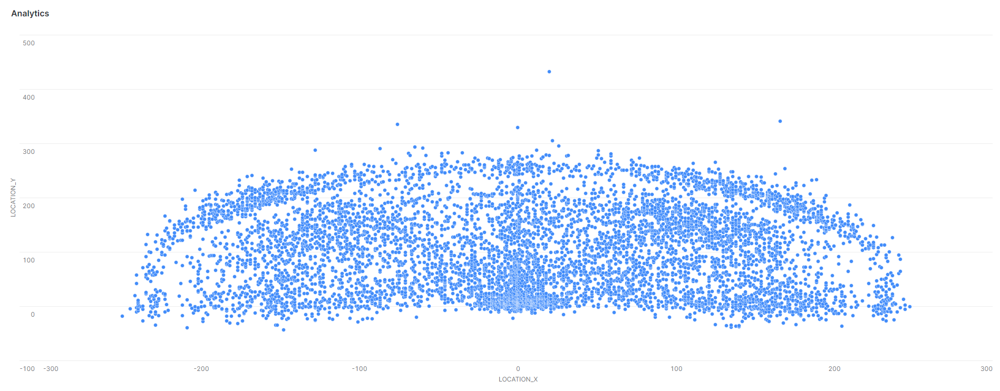

# Goals Statistics

## Locations where goals were done

<figure markdown>
  { width="800" }
  <figcaption><small>Goals Locations</small></figcaption>
</figure>

## Goal Stats by [Knockout] Matches

|KNOCKOUT_MATCH  |           MIN_GOALS       |       MAX_GOALS       |       AVG_GOALS       |          MEDIAN_GOALS|
|----------------|---------------------------|-----------------------|-----------------------|----------------------|
|NO              |           0               |       20              |       6.57            |          6           |
|YES             |           0               |       15              |       6.92            |          7           |

## Goals with 1-10 minutes remaining for the end of the match

|REMAINING_1    |   REMAINING_2_5 |    REMAINING_10   |
|---------------|-----------------|-------------------|
|2,038          |   3,814         |    3,876          |