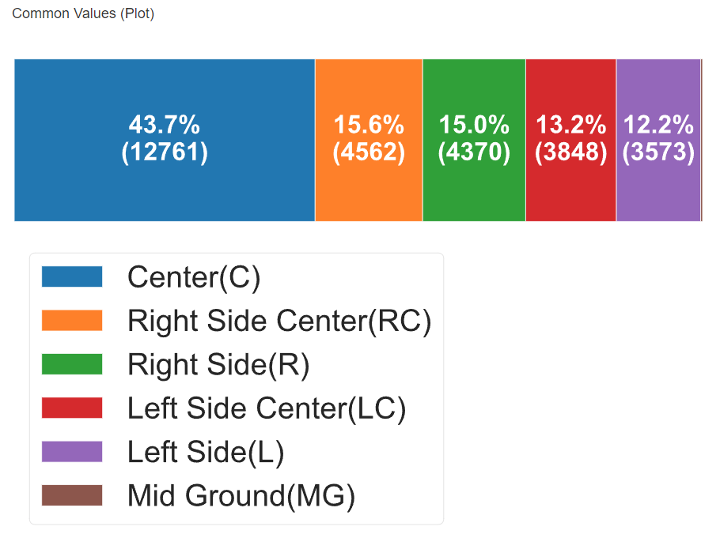
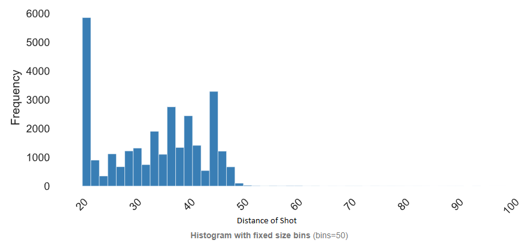
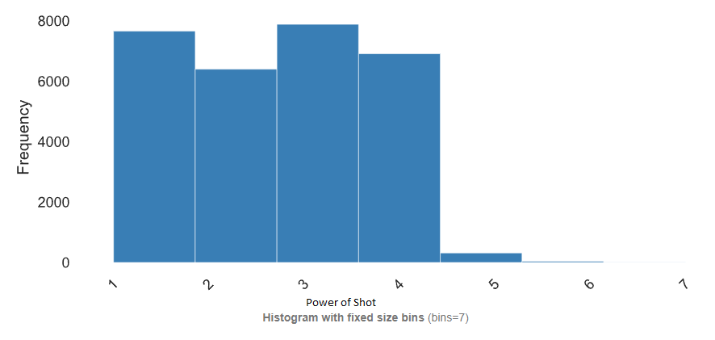

# Shots Statistics

## Area of Shot

<figure markdown>
  { width="600" }
  <figcaption><small>Area of Shot</small></figcaption>
</figure>

## Distance of Shot

<figure markdown>
  { width="600" }
  <figcaption><small>Distance of Shot</small></figcaption>
</figure>

## Power of Shot

<figure markdown>
  { width="600" }
  <figcaption><small>Power of Shot</small></figcaption>
</figure>

