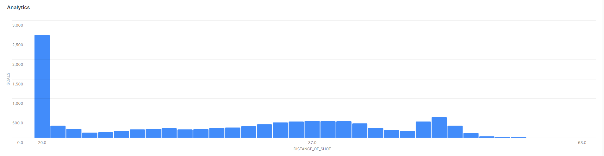
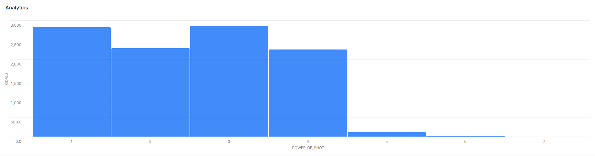

# Shots vs Goals

## Distance of Shot X Goals

<figure markdown>
  { width="800" }
  <figcaption><small>Distance of Shot vs Goals</small></figcaption>
</figure>

## Power of Shot X Goals

<figure markdown>
  { width="800" }
  <figcaption><small>Power of Shot vs Goals</small></figcaption>
</figure>

## Goals over Type of Shot - Top 5

|SHOTS         |   GOALS  |
|--------------|----------|
|shot - 3      |   3,715  |
|shot - 4      |   1,810  |
|shot - 1      |   522    |
|shot - 39     |   432    |
|shot - 44     |   330    |